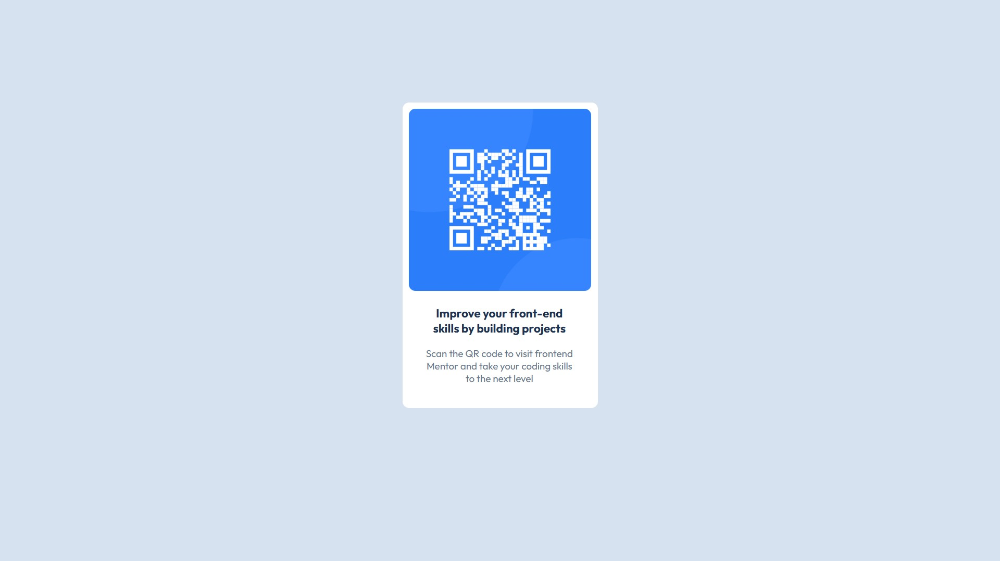

# Frontend Mentor - QR code component solution

This is a solution to the [QR code component challenge on Frontend Mentor](https://www.frontendmentor.io/challenges/qr-code-component-iux_sIO_H). Frontend Mentor challenges help you improve your coding skills by building realistic projects. 

## Table of contents

- [Overview](#overview)
  - [Screenshot](#screenshot)
  - [Links](#links)
  - [Built with](#built-with)
  - [What I learned](#what-i-learned)
  - [Continued development](#continued-development)
  - [Useful resources](#useful-resources)
- [Author](#author)
- [Acknowledgments](#acknowledgments)


## Overview

### Screenshot



### Links

- Solution URL: [Add solution URL here](https://your-solution-url.com)
- Live Site URL: [Add live site URL here](https://your-live-site-url.com)

### Built with

- Semantic HTML5 markup
- CSS custom properties
- Flexbox

### What I learned

I learnt about Flexbox and Grid, i also learnt how to center a div, text and so on.


```html
<p class="text-title">Improve your front-end skills by building projects</p>
```
```css
.text-title {
  font-family: "Outfit", serif;
  font-size: 18px;
  font-weight: 700;
  color: hsl(218, 44%, 22%);
}
```

### Continued development

I'll be developing my skills in using the flexbox and grid, i'm not too familiar with that yet. 

### Useful resources

- [web.dev](https://web.dev/) - This is an amazing article which helped me understanding Flexbox and Grid. I really liked this pattern and will use it going forward.
- [ChatGpt](https://chat.openai.com/) - This helped me with my CSS styling mostly. I'd recommend it to anyone still learning this concept.


## Author

- Website - [Eneh Franklyn Okechukwu](https://www.linkedin.com/in/frank-okey-61a70025a)
- Frontend Mentor - [@Phrank08](https://www.frontendmentor.io/profile/Phrank08)
- Twitter - [@enehfranlyn8](https://x.com/enehfranklyn8?s=09)

## Acknowledgments

I did this project myself.